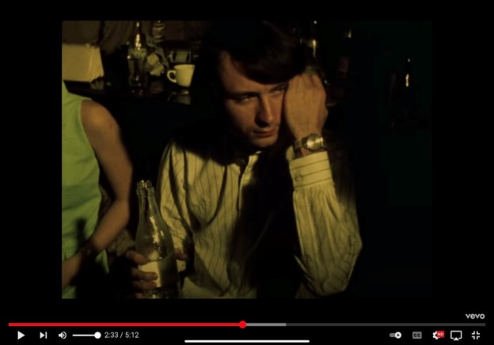
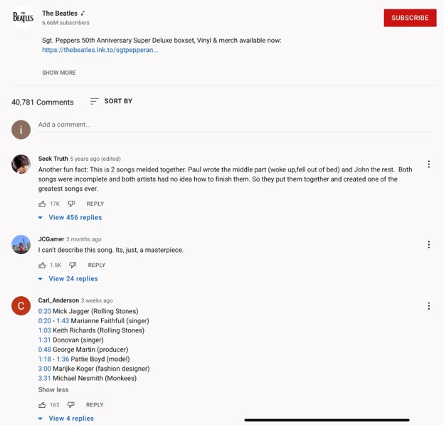
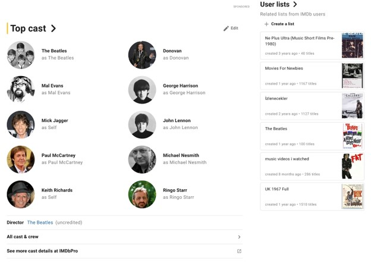
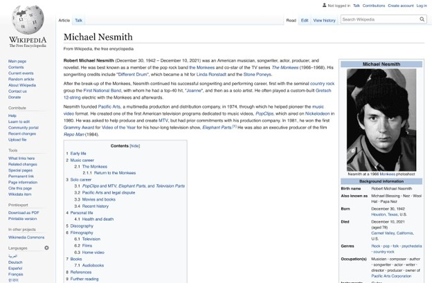
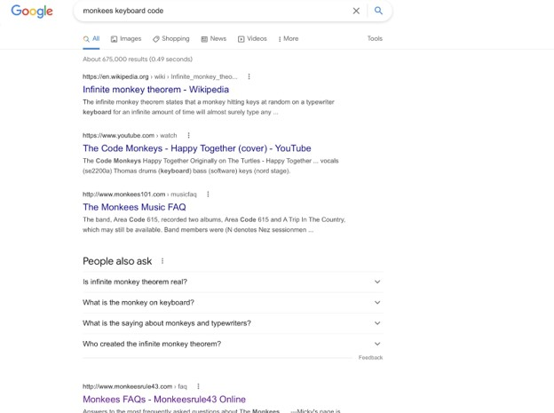
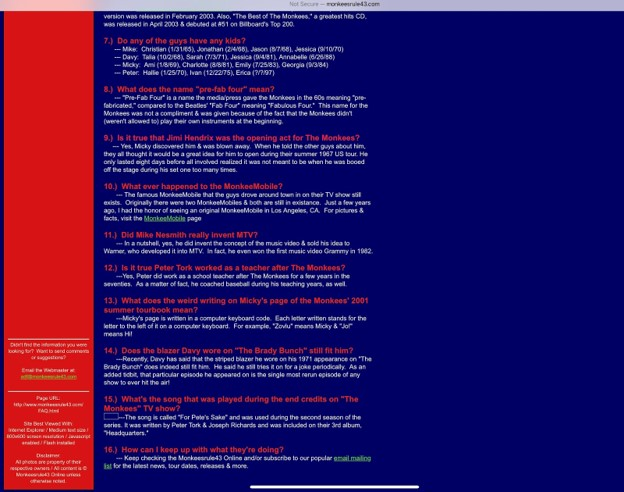

# 43 Writeup
The first step is figuring out the code. If you look at the description, it says “at your fingertips”, which is a somewhat hint to the code. You can also double check your work at the end of the challenge. But the code is actually everything to the right of the letter you mean for the keyboard. It’s a bit funky since some keyboards can look different, but overall the basic keyboard should get you to something along these lines. This is showing that the code above is “A day in the life 2:34”.

This should take you to the Beatles “A Day in the Life” music video on YouTube. If you search up “A Day in the Life music video,” it should be the very first link to show up. Next go to the time stamp of 2:34. It shows you this man. He first shows up around 2:32, but the most clear shot of him should be in roughly 2:33 to 2:34.

Most people would try to reverse image search, but the images coming up for it don’t work very well. But, if you were to look up Beatles A Day in the Life music video cast (I used IMDB for this), you will be able to see people who were in this video. Also if you read the comments of the YouTube video it should also give you another time stamp with him in it and his name(and the name of the band he is in which is important)!!

If you go the IMDB route and search through those people, you’ll find the guy who is in the music video. It helps to look up these people but younger, or in the year 1967 when the music video was made so it is more accurate. You’ll find that the man is Michael Nesmith. 

If you do a quick wikipedia search, you’ll find that Michael Nesmith was a member of the band closely related to the Beatles called the Monkees. This is one of the very first things it lists on his Wikipedia which is an incentive to search and look into that part more. Also if you followed along with the YouTube comments you would have gotten the Monkees band name from there.

From here you would search for the code, which is related to keyboards and the monkees, and be on the lookout for the number 43. You could also search anything along the lines of monkees 43 and be able to find the website you need. 

If you spot it, the website “monkeesrule43” has information to do with the keyboard code, specifically in the FAQ section(which you would have to do some digging in to find it from the main site, thank you control-F)! The website and question 13 of FAQ tells you the name of the Monkees band member who created the code: Micky Dolenz. Like I mentioned above, you could also just search in control-F for “keyboard” or “code” and find it a lot easier that way.

The flag would be ctf{Micky_Dolenz}.

**Flag** - `byuctf{Micky_Dolenz}`