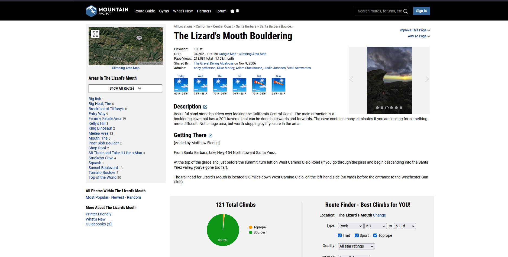
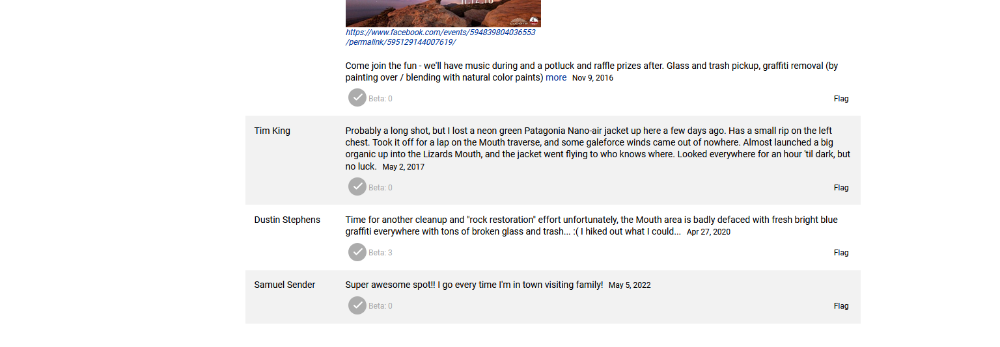
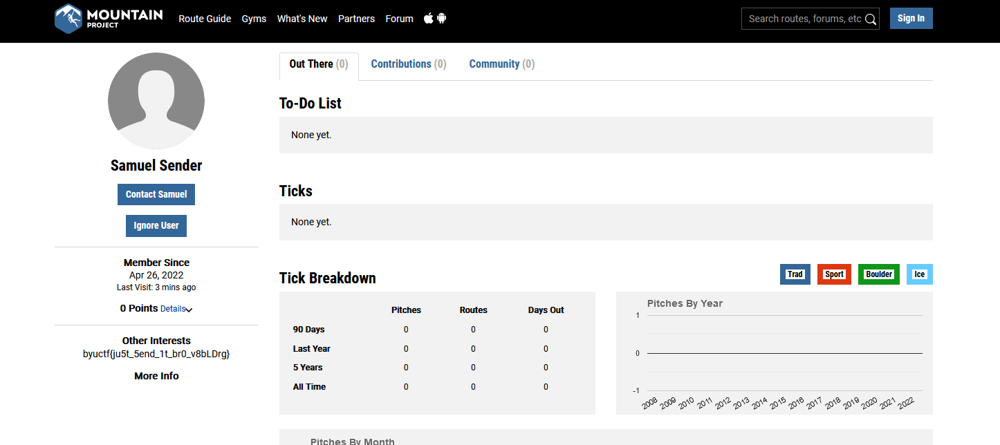

# B0uld3r1ng Writeup
The goal here is to get people to think outside the box on what social media they check. The picture is of Lizard's Mouth Rock in Santa Barbara, California, a popular local climbing spot.

Various search terms such as "reptile rock", "reptile rock california" and other combinations can be used to find that it is Lizard's Mouth Rock in Santa Barbara, Calfornia. However, we still need to find Sam. We know he is climber so looking for climbing and Lizard's Mouth bring us to here:

https://www.mountainproject.com/area/105885134/the-lizards-mouth

and the comments...

There is a comment by a user "Samuel Sender", this is our guy. Following his profile will give you the flag

**Flag**: `byuctf{ju5t_5end_1t_br0_v8bLDrg}`
