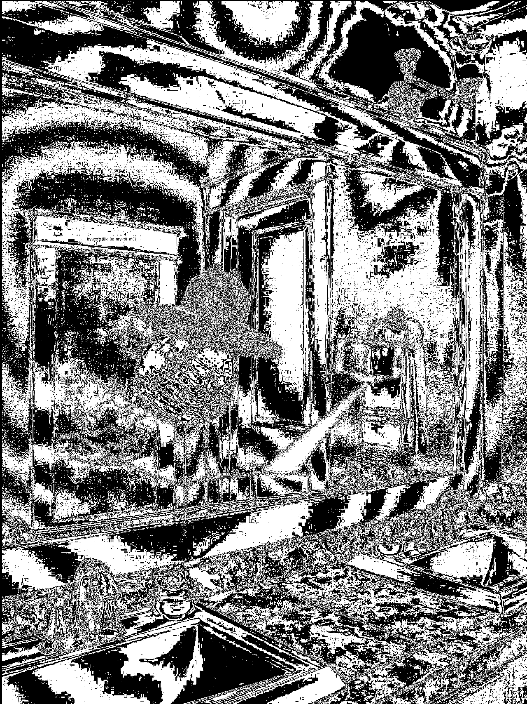

# Challenge #1 Buckeye Billy Birthday 
```
Buckeye Billy, our sweettooth, nutty, history loving friend, has a birthday coming up!
Billy is as cryptic as can be, and we have no idea what to get him for his birthday. 
We did find three hints on written on his desk. 
Can you help us find where we should buy a gift from?
https://mywordle.strivemath.com/?word=sokhc 
https://mywordle.strivemath.com/?word=yocod
https://mywordle.strivemath.com/?word=lffep
byuctf{storename}
```
The three words are: 
- Water 
- Probe
- Calls

Although they are given in a different order, identifying the cinncinati one as correct, as it is in the Buckeye State. (Ohio). It is also the main one around the most shopping areas. Using the what3Words system, you find yourself in an alley/park in town found at the following address: 

967 E McMillan St
Cincinnati, Ohio.


This address doesn't have a store. Although this was intended to help you dive deeper, i realize it probably confused more people than it helped. 

Looking back at the description, it mentions history. Maybe it was something that used to be there. Although we do not have a wayback machine for locations as much, we can still google each location. 
If you google this address, this site is one of the first results: 
https://www.graeters.com/about-us/our-history


Billy, also described as a sweettooth, would probably be interested in something sweet like ice cream for his birthday. Thus we arrive at the store being Graeters, an ohio ice cream company, founded at this location. 

Additional notes: Hints given and their meaning: 
Googling something in different ways whenever you have new information is a *great* move. 

So this hint is designed to point you in the direction of googling everything. One of the best ways to improve at OSINT is to get in the habbit of googling a lot. Each new piece of information, especially in OSINT problems opens up additional paths. Getting good at exploring those paths, and connecting dots is a skill to practice. It is furstrating at times but so is learning. 

Also i emphasized great since it is similar to the flag name as a sort of hint once people found the solution. 

Hints found in Buckeye Birthday Blabbin: 
- Two tweets include songs with titles "Ice cream" and "Greater"
- web.archive has an old tweet related to another problem in this series that was not included of a street screenshot. That tweet had the description of Billy being out for a walk and super close to the store. There is a graeters located less than a quarter-mile from the screenshot. [link](https://web.archive.org/web/20220415232856/https://twitter.com/William_buckeye/status/1515109844771999745)


#### Solution: byuctf{graeters}

# Challenge #2 Buckeye Billy Blabbin'
```
Buckeye Billy discovered social media. And probably posts too much. Try to see what you can find. for this problem and others!

Flag format: byuctf{insert_text_here}
`````
Applying google-fu and searching both on google and on various social media sites, leads you to this profile. Hopefully the byu logo helped identify that it was our character. 
[Twitter Profile](https://twitter.com/William_buckeye)

Looking through his twitter, you see a bunch of different information! 
You see lyrics of various songs: 
- Boulevard of Broken Dreams
- The Sound of Silence
- 3 Words
- One Place
- Greater
- Ice Cream
- Man in the Mirror
- Magic Mirror

Different locations: 
- BYU Creamery
- Rancherito's Mexican Food
- Buc-ees
- Bricks Clothing
- Some Bathroom off the internet
- Field of Corn, Dublin OH (Archived tweet, see above)

And other themes represented: 
- Pigeons/Birds
- Cats
- Michael Jackson
- Ohio State Buckeyes
- Chili/Sports Game Food
- Fortnite
- Star Wars
- Hockey
- Basketball
- BYU Cosmo

A bit of meta-CTFing or OSINT experience will tell you that a flag that is out in the wild (i.e. you find the entire byuctf{} string, not just an answer) means that there will be some sort of inputted or planted data. 
That should help narrow what to focus on. In this case, you should focus on anything we as creators can edit. Such as tweets, or lists or photos. 
A closer examination of the photos is always a good strategy. 

One common thread between the three is Micheal Jackson and his song Man in the Mirror. Billy has posted a mirror selfie. 
[Specific Tweet](https://twitter.com/William_buckeye/status/1515113600750219265?s=20&t=ipt7KpI2xUaPTKZpRsXJVg)


Stegonline is a very standard, well known tool and should be a go to for images in CTFs. 
if you were to put the mirror pictures into the steg detector (although there is no steg involved, it is simply inserted into the picture with a color similar to the frame) 
you would identify the flag easily on three different settings: 

Or if you browse by bitplanes: 

These show it fairly clearly. 


Flag is found within the doorframe circled below: 

#### Solution: byuctf{t@lk_0s1nty_t0_m3}
