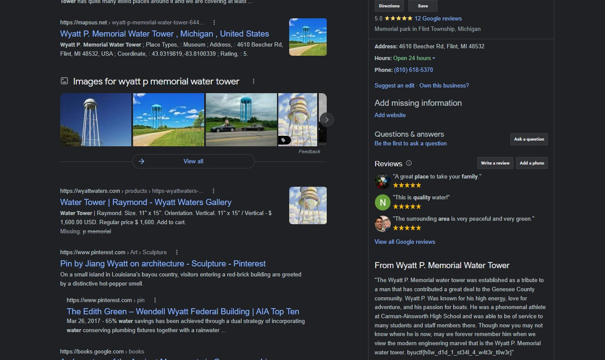

# Squatters Rights Writeup
The competitor is presented with a picture. The sign on the right is for the Pioneer State Mutual Insurance Company corporate headquarters. With a google search of "Pioneer Mu", it can be found on the google. Then after finding the intersection on google maps, you can look at the different places that are in the image, including THE WYATT P MEMORIAL WATER TOWER!!!!!!!! *GASP* If you search the Wyatt P Memorial Water Tower on the Google, look at the right pane where it has the google maps info, go down to where it says "From Wyatt P. Memorial Water Tower", there is some inspiring text about the famed Wyatt P. Click more, and BAM. The flag is in the text on the Google! 

**Flag**: `byuctf{h0w_d1d_1_st34l_4_w4t3r_t0w3r}`

## Playtester Notes

This was a lot of fun. Finding the company name wasn't too difficult but the flag location was unexepected and took some searching. We may need to specify that the flag is in the normal format because I think people could get confused that it might be the state name or the name of a location in the picture.
