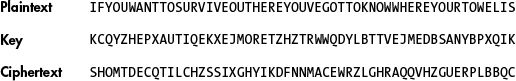
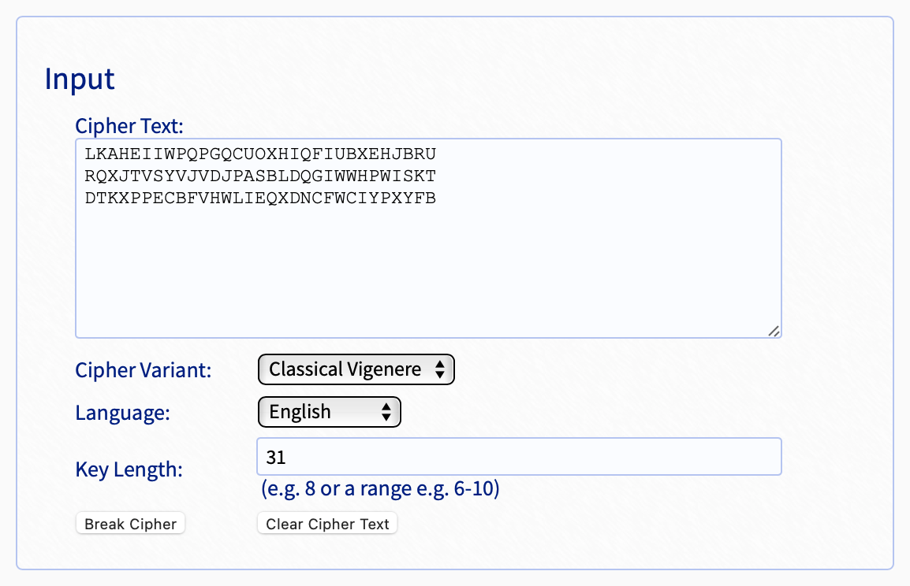
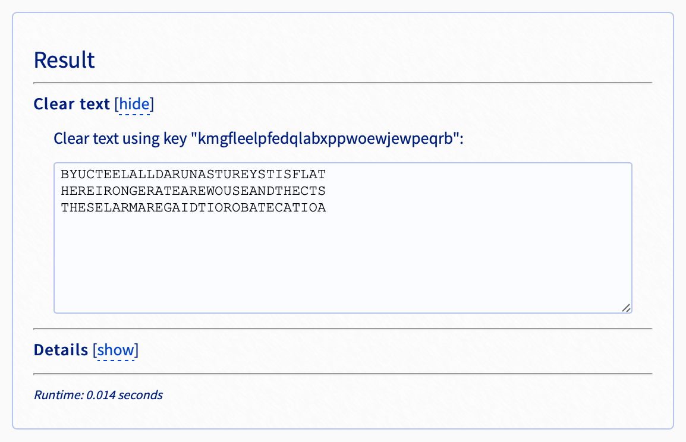
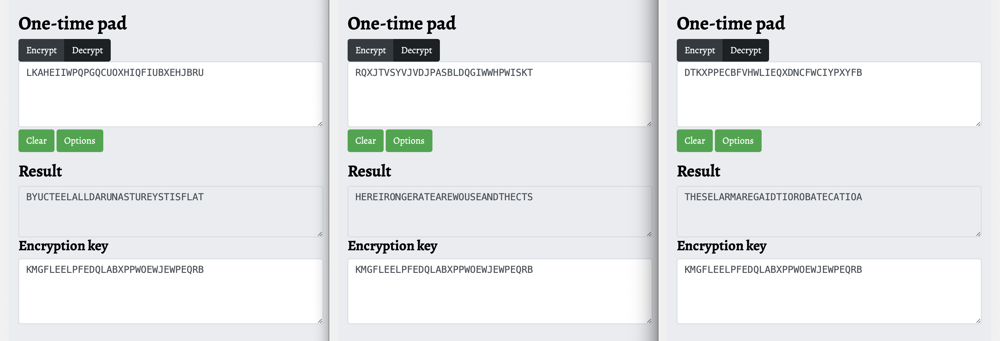
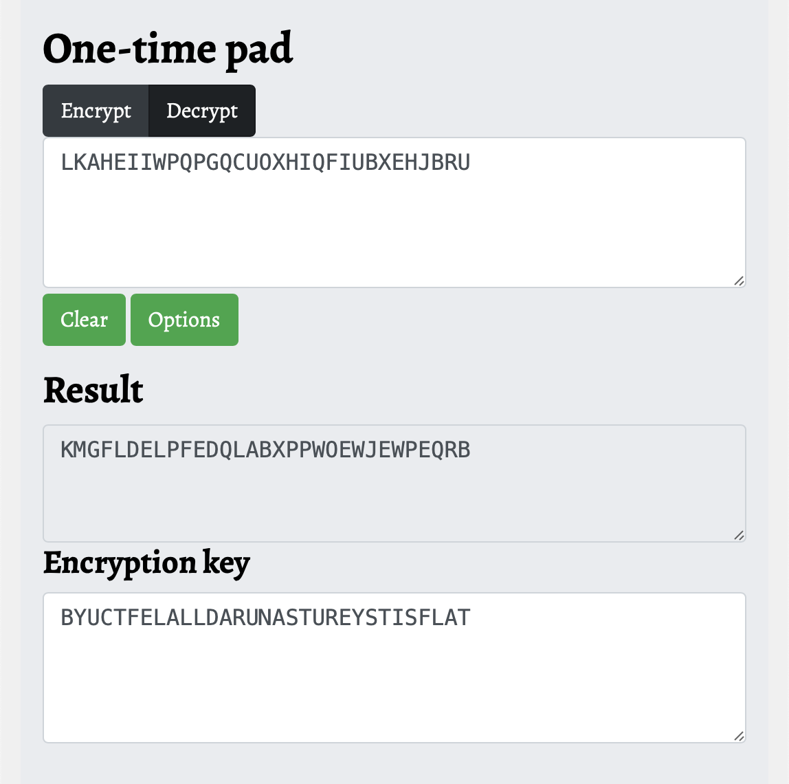
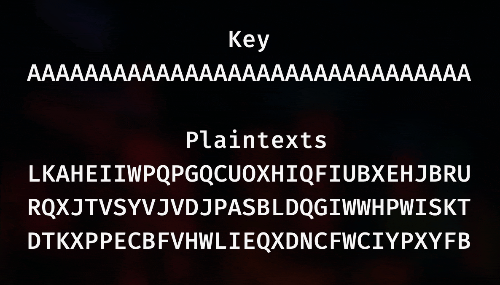

# Too Many Times Writeup
## Introduction to One-Time Pads

###### Writeup by [phishfood](https://ctftime.org/user/136455)

If you've ever heard of a [one-time pad](https://en.wikipedia.org/wiki/One-time_pad), you may remember that it is known for being unbreakable when implemented properly.  A one-time pad works by combining plaintext with a completely random key, one letter at a time.  When using an alphabet of only A–Z, this typically means converting the letters in the key to numeric values and shifting the corresponding letter in the plaintext by that amount, much like one would in a [Caesar cipher](https://en.wikipedia.org/wiki/Caesar_cipher).  In other cases, such as when data is hex-encoded, the plaintext and key are typically XORed in order to generate the ciphertext.

The reason this method of encryption is so secure can be demonstrated in the scenario below:

> Imagine you are given the ciphertext `PWQMXCVWOGKNRQBPHTN`.  You discover that when combined with the key `MIDTSOEQKNRZQWDLBNV`, you can decrypt the message `DONTFORGETTOBUYEGGS`.  You've solved it, right?  But wait, using the key `WPMAXUSEVSZJYJXJDHV`, the message becomes `THEMAIDSTOLETHEGEMS`!  There's no way of knowing which key is correct, because we can make the message say whatever we want it to just by using a different key.

When using a one-time pad, it is necessary to fulfill [four conditions](https://en.wikipedia.org/wiki/One-time_pad) in order to maintain perfect secrecy:

1. The key must be at least as long as the plaintext.
2. The randomization method used to generate the key must be cryptographically secure.
3. The key must never be reused.
4. The key must be kept secret.

We saw in another challenge, [One Time Pad](./onetimepad), that a weakness was introduced to the cipher when a weak password was used as the key.

In this challenge, the weakness in the cipher is referred to in the challenge name: "Too Many Times."  This, combined with the mention of the enemy having "made a mistake" while encrypting the messages and the fact that we are given three messages of the same length all suggest that the same encryption key may have been used for each message.

## Cracking a Many-Time Pad

It was easy to for me to [find tools and resources for cracking many-time pads](https://www.google.com/search?q=many+time+pad+cracker), but the majority of them are intended to work with hex-encoded strings rather than alphabetical strings, and many of the cracking methods involve looking for spaces in the plaintext.  Neither of these things are very applicable to this situation.

After a lot of searching, I came across [a resource](https://inventwithpython.com/cracking/chapter21.html) that seemed like it might be a little more applicable than others for cracking our many-time pad.  All of the examples on this site involved ASCII-encoded (alphabetical) ciphertexts, plaintexts, and keys, all without any spaces.  Here's one example from the site:

The ciphertext looks pretty similar to the ones we are trying to decrypt!

Towards the bottom of the page, there are two subheadings that seem particularly applicable "Avoiding the Two-Time Pad," and "Why the Two-Time Pad Is the Vigenère Cipher."  Under the second subheading, we can find the following statement:

> If we can show that a two-time pad cipher is the same as a Vigenère cipher, we can prove that it’s breakable using the same techniques used to break the Vigenère cipher.

This seems like a lead!  None of the tools for cracking a many-time pad were very helpful, but maybe we can find something for cracking a vignère cipher.

### Cracking as a Vignère Cipher

The main difference between a one-time pad and a Vignère cipher is that a Vignère cipher uses a repeating key (e.g. `BYUCTFBYUCTF`) rather than one that is the same length as the plaintext.  Since each of our one-time pad cipher texts are the same length and are suspected to use the same key, we can try concatenating them and solving them as a Vignère cipher with a key length of 31 (the length of each message).

With this realization, I looked for automated tools for solving Vignère ciphers.  After trying a couple of different websites, I found one ([found here](https://www.guballa.de/vigenere-solver)) that yielded particularly promising results:

 

As shown in the images above, setting the ciphertext to

`LKAHEIIWPQPGQCUOXHIQFIUBXEHJBRU` 
`RQXJTVSYVJVDJPASBLDQGIWWHPWISKT` 
`DTKXPPECBFVHWLIEQXDNCFWCIYPXYFB`

with a key length of 31 yielded a plaintext of

`BYUCTEELALLDARUNASTUREYSTISFLAT` 
`HEREIRONGERATEAREWOUSEANDTHECTS` 
`THESELARMAREGAIDTIOROBATECATIOA`,

produced by the key

`KMGFLEELPFEDQLABXPPWOEWJEWPEQRB`.

All three plaintexts seem to begin with and contain actual words.  The fact that the first looks like it is going to start with `BYUCTF` is particularly promising.  From here, we can start making manual adjustments to the auto-generated key to get the correct plaintexts.

### Final Steps

Now that I've got a key to use as a starting point, I can make adjustments to the key until I find the correct one.  I opened a [one-time pad solver](https://www.boxentriq.com/code-breaking/one-time-pad) in three different windows, each with a different ciphertext using the key that was generated above.

Initially, I changed individual letters in the key, approximating how much a letter needed to shift by in order to cause the correct change in the plaintext.  As I worked though, I realized that because of the way decryption works, the key and plaintext are swappable.  This meant I could instead put the desired plaintext into the key field, and the decryption process would then give me the key needed to create that plaintext.  This allowed me to decode the many-time pad much faster.  This can be seen below:

Notice that I changed the beginning of the plaintext from `BYUCTE` to `BYUCTF`.  Making that change caused the beginning of the key to change from `KMGFLE` to `KMGFLD`.

From here, I copied the new key into the other windows, and I could see how the other plaintexts were affected by the adjusted key.  Moving back and forth between windows, I repeated these steps, making corrections to plaintexts based on context, and then updating the key in each window.

The animation below demonstrates how making changes (shown in green) to one plaintext affects the key and thus the other plaintexts (with those effects shown in magenta).  There was a little more trial and error involved than shown below, but it is an accurate representation of the steps one may take in solving for the correct key, minus the errors along the way.

**Flag** - `byuctf{imgladyoucapturedthisflag}`
