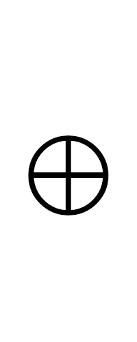

# XQR

###### Challenge and Writeup by [phishfood](https://ctftime.org/user/136455)


## Challenge

I love QR codes!  But maybe it's true what they say about having too much of a good thing...

[xqr.png](./xqr.png)


## Solution

#### Intro to XOR

The name of the challenge, "XQR," hints at the fact the the solution will involve XORing the different QR codes.  XOR (short for "exclusive or") is a logical operation that takes two inputs and returns `true` if and only if one input is `true` and the other is `false`.  Below is a truth table for the XOR operation:

| a       | b       | a ⊕ b   |
|---------|---------|---------|
| `false` | `false` | `false` |
| `false` | `true`  | `true`  |
| `true`  | `false` | `true`  |
| `true`  | `true`  | `false` |

You can XOR more than just booleans, however.  For example you can XOR two integers:

`42 ⊕ 33 = 11`

In the above example, the bits in the binary representation of the digits are what is actually being XORed:

`101010 ⊕ 100001 = 001011`

#### XORing Images

The QR codes in [xqr.png](./xqr.png) are made up of black and white pixels.  If we treat each black pixel as a `0` or `false` and each white pixel as a `1` or `true`, they can be XORed just as we saw above with booleans and bits.  Here is another truth table, this time using pixels:

| a  | b | a ⊕ b |
|----|---|-------|
| ⬛️ | ⬛️ | ⬛️    |
| ⬛️ | ⬜️ | ⬜️    |
| ⬜️ | ⬛️ | ⬜️    |
| ⬜️ | ⬜️ | ⬛️    |

Let's consider a smaller challenge, [xqr3x3.png](./img/xrq3x3.png):

<br>

To find the flag, we begin with any single QR code [xqr.png](./xqr.png).  Then, one by one, we XOR it with all of the other codes in [xqr.png](./xqr.png).  This process is demonstrated below:

<br>

Scanning the final result reveals the flag!

#### Automating the Solution

Solving a 3x3 challenge isn't too difficult, even by hand (see [b&w_xor_using_gimp.xcf](./extra_resources/b&w_xor_using_gimp.xcf) for an example of how this can be done), but if we're ever going to solve something as large as [xqr.png](./xqr.png), we'll need to automate the process.

There are many different ways of doing this, but I used the [Pillow](https://pillow.readthedocs.io/en/stable/) (aka PIL) library in Python.  PIL makes it easy to process images pixel by pixel, and even includes a function for XORing images.  The following code can be used to reconstruct the flag QR code from [xqr.png](./xqr.png):

```python
from PIL import Image, ImageChops

# the height/width of an individual QR code (including 1 px border)
CODE_SIZE = 27

# each extracted QR code will be temporarily stored here
tmp_qr = Image.new(mode='1', size=(CODE_SIZE, CODE_SIZE), color=1)

with Image.open('xqr.png') as image:
	IMAGE_SIZE = image.size[0]
	# iterate through each QR code
	for start_y in range(0, IMAGE_SIZE, CODE_SIZE):
		for start_x in range(0, IMAGE_SIZE, CODE_SIZE):
			# copy the pixels of the current QR code into tmp_qr
			for y in range(0, CODE_SIZE):
				for x in range(0, CODE_SIZE):
					p = image.getpixel((start_x + x, start_y + y))
					tmp_qr.putpixel((x, y), p)
			# if tmp_qr is the first code, copy its contents to qr_flag
			if start_x == start_y == 0:
				qr_flag = tmp_qr.copy()
			# otherwise, set qr_flag to qr_flag XOR tmp_qr
			else:
				qr_flag = ImageChops.logical_xor(qr_flag, tmp_qr)

qr_flag.save('flag.png')
```

#### TL;DR
XOR all of the QR codes together, and the resulting QR code will reveal the flag when scanned!


## How It Works

The following is an explanation of how this challenge was created.  It will explain the process of creating [xqr3x3.png](./img/xqr3x3.png), but the process for creating larger challenges such as [xqr.png](./xqr.png) works exactly the same way.

#### Using XOR to Hide Information

Let's say we want to hide a secret value, `1337`, in a set of numbers.  We start by taking an arbitrary set of numbers, and XORing them together:

`500 ⊕ 123 ⊕ 999 ⊕ 42 = 578`

Next, we XOR our secret value with the result from above:

`1337 ⊕ 578 = 1915`

Now, XOR the result from the above equation with our first equation, we will discover our secret value!

`1915 ⊕ 500 ⊕ 123 ⊕ 999 ⊕ 42 = 1915 ⊕ 578 = 1337`

#### Hiding a QR Code

Now let's do it with QR codes.  We'll start with the code that we want to hide, [flag.png](./img/flag.png):

<br>

Next, we'll generate a set of 8 codes from random text, resulting in the following codes:

<br>

If we XOR all of the random codes together (not including the flag), we obtain the following:

<br>

Lastly, we'll XOR the image above with the flag:





<br><br>

You may notice that if you attempt to scan the resulting QR code, it is invalid.  That is because it is not a QR code at all!  It is an image specially designed to give us our flag QR code back when XORed with the 8 random codes that we started with.  It is for this reason, along with the fact that it will be placed in the center of [xqr.png](./xqr.png), that this image is referred to as the "keystone" in [create.py](./create.py).  Going back to our numeric example, the keystone would be analogous to the value of `1915`.

Now that we have all the elements of [xqr.png](./xqr.png), we can put them all together.  Notice that the code in the center matches the keystone as calculated above.  Surrounding it are the 8 random codes that were generated.

<br>

All of these steps are automated in [create.py](./create.py) to create massive challenges, such as [xqr.png](./xqr.png) (shown below).


