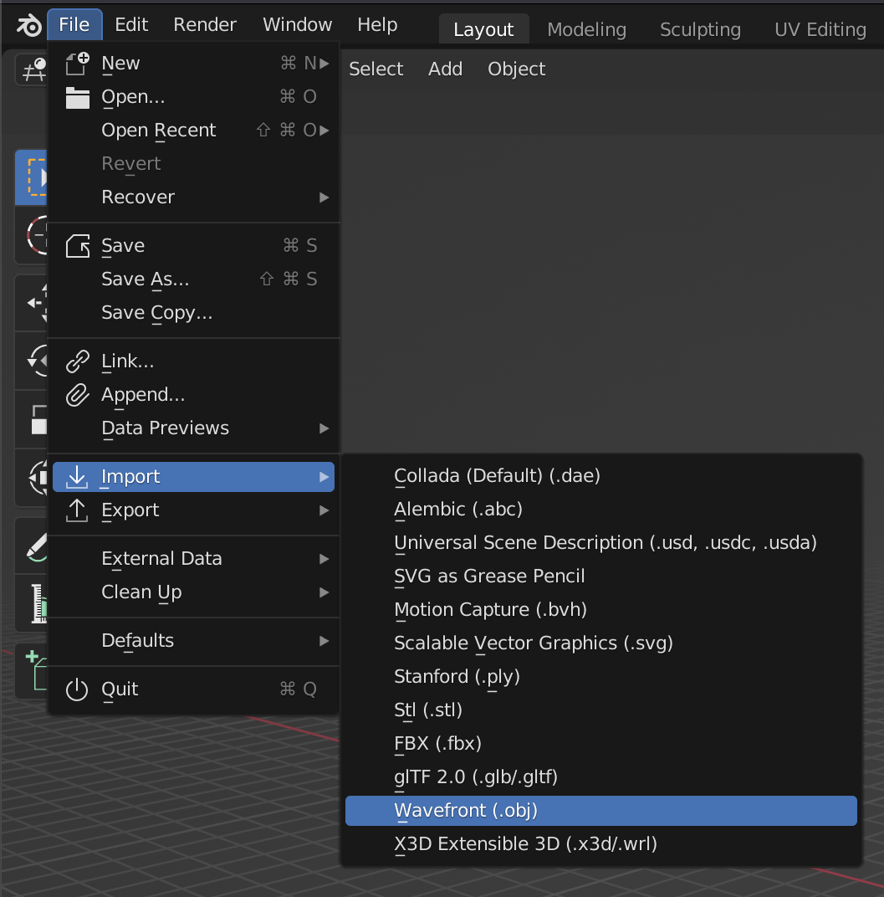
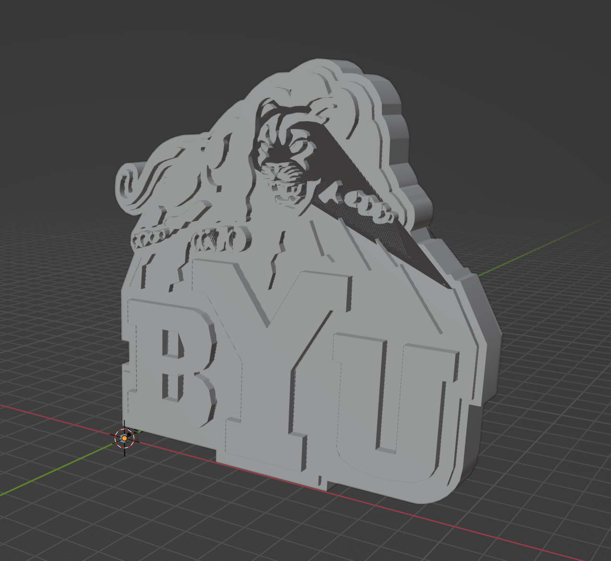
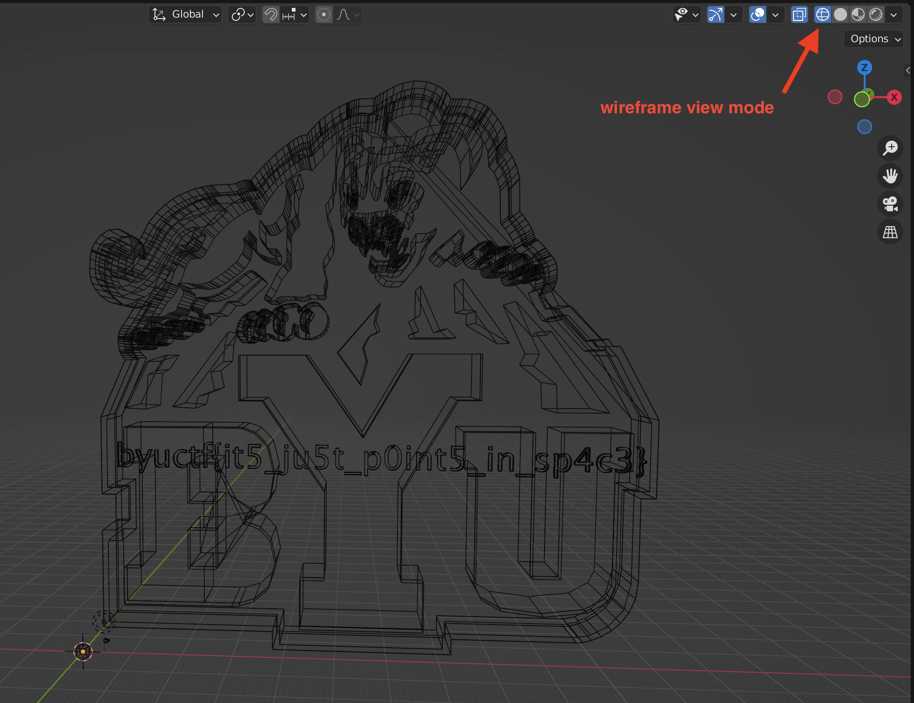

# Banana Smoothie

###### Challenge and Writeup by [phishfood](https://ctftime.org/user/136455)

## Challenge

I found this flag on the CTF admin's computer, so I figured I'd just give it to you.  The only problem is I don't know how to open it.

[flag.png](./flag.png)

## Solution

Even though the file has a png extension, it doesn't seem to open properly.  If you use the command `file flag.png`, you'll see that the file is actually an ASCII text file.  Running `cat flag.png` will output a bunch of numbers, but if you look at the first few lines of the file, you'll see the following:

```
# This file uses centimeters as units for non-parametric coordinates.

mtllib byu2.mtl
g default
```

Doing a quick Google search to look up either the first line of text or what a mtl file is, you can discover that flag.png is actually an obj file.  Once the extension is fixed, the file can be viewed either on an online site such as https://3dviewer.net, or locally if you have a program that can open it.  Below is what the file looks like in macOS's Preview:


Clearly it's the BYU logo, but there aren't any apparent flags.  We'll need to inspect it more closely.  As you may have guessed based on the name of this challenge, we're now going to open the file up in [Blender](https://www.blender.org).  Blender is a free and open-source 3D graphics application that will allow us to look at the 3D model more closely as well as edit it if need be.  Other applications such as Maya should work as well if you have access to them.

Once Blender is open, we can import our obj file:



It may look like nothing happened when you import the file, but you actually just need to zoom out and you'll see the model:



If you know what you're doing, or just happen to stumble upon the right button, you may just find your way in to wireframe view mode and find what you're looking for:


