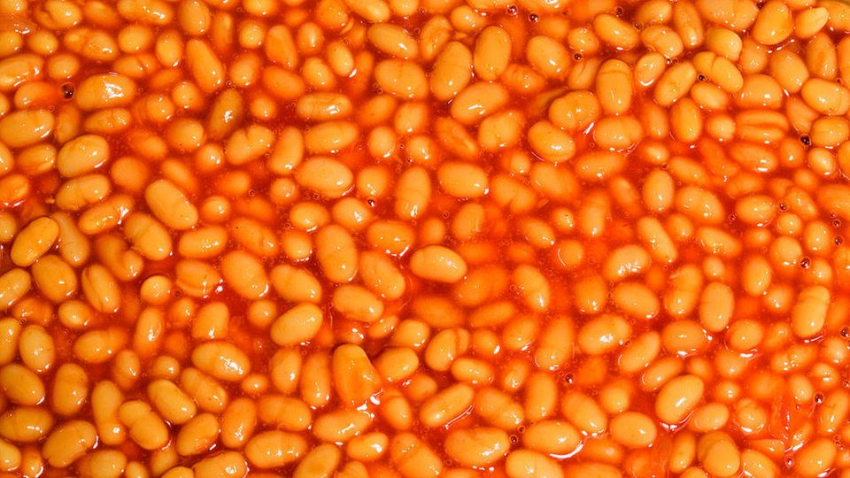
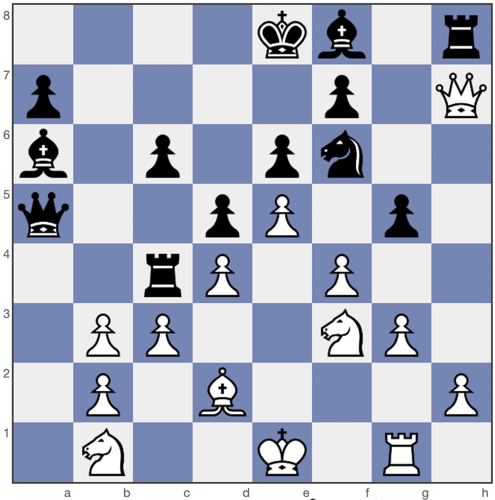
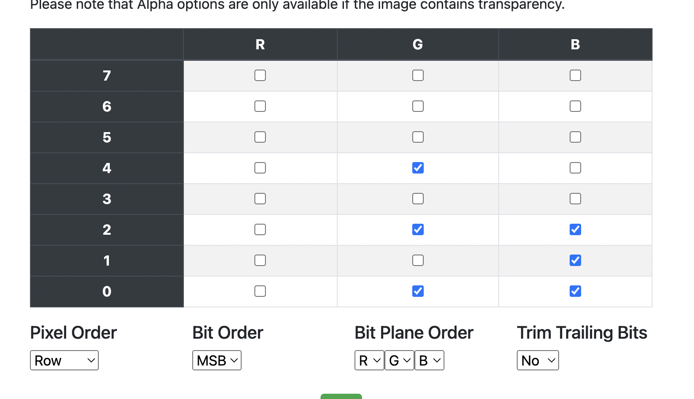
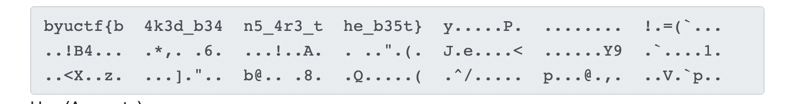

# Beans Beans Beans Writeup
You are given 2 images to start with; the first is the image of baked beans where the flag is hidden using LSB. If you look at the top left corner you can see that some of the pixels are out of place indicating there might be something hidden there.

The key to the order and which bits the flag is hidden in are contained within the second image. Most of the pieces on the chessboard serve no purpose. The only two columns that are of use are B and G which correspond to Blue and Green. The 8 bits in a byte correspond to the 8 different rows on the chessboard starting at the bottom, since the bits start at 0 you need to do n-1 to get the proper index value. So bits to look at for the flag become G0, G2, G4, B0, B1, B2

Using [stegonline](https://stegonline.georgeom.net/image) you can upload the image and enter the bit values to look at which gives the flag `byuctf{b4k3d_b34n5_4r3_the_b35t}`

