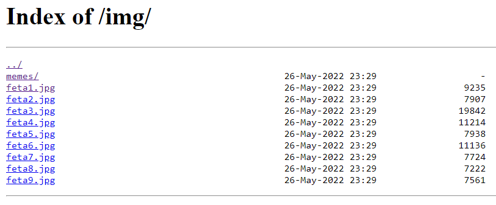

# Fetaverse Writeup
The description talks about how "well designed" the site is, so that's a clue to look at the site design. The site is pretty much just one page - looking at the HTML reveals that it's just one page with some images and other secondary files. If you open an image in another tab and go back to the directory, it'll reveal that directory listing is enabled.

This reveals a folder not linked anywhere called "memes". Inside are photos of cheese, and the flag is found in the last image.

**Flag**: `byuctf{welc0me_t0_the_fetaverse}`

## Hosting
Move the static files to a new Nginx subdomain, and modify the configuration file `/etc/nginx/sites-available/fetaverse.byuctf.xyz` by adding the following line inside of the `location / {}` block - `autoindex on;`. This should allow directories to be listable.